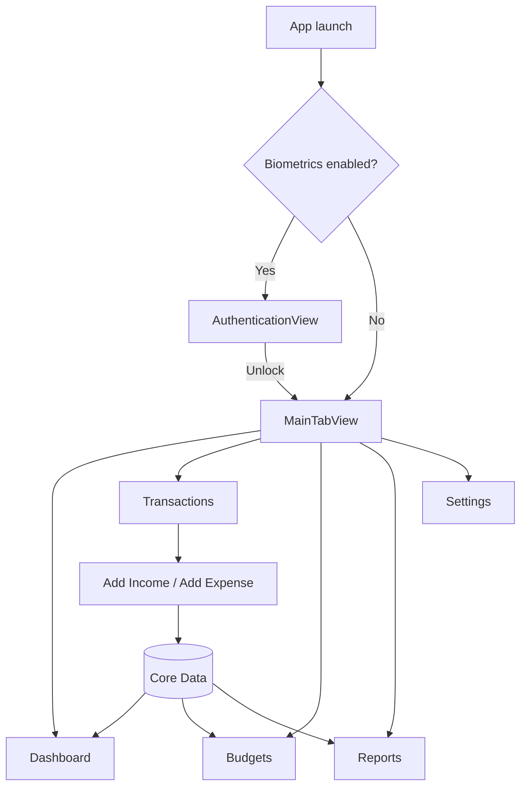

# Finance Tracker

A native iOS personal finance app for tracking income, expenses, budgets, and spending reports. Built with SwiftUI and Core Data; all data stays on the device.

**Repository:** [github.com/mayankkk0801/finance-app-tracker](https://github.com/mayankkk0801/finance-app-tracker)

---

## Features

| Area | What it does |
|------|----------------|
| **Transactions** | Add income or expenses with category, date, and notes. Search, filter (All / Income / Expenses), swipe to edit or delete, pull to refresh. |
| **Dashboard** | Balance, income vs expenses cards, spending-by-category chart, budget progress, recent transactions, quick add income/expense. |
| **Budgets** | Monthly budgets per expense category. Progress bar and status (on track / warning / exceeded). |
| **Reports** | Income vs expenses bar chart, expense pie chart by category, monthly trend lines. Export CSV or PDF. Time filters: week, month, year, all time. |
| **Security** | Optional Face ID / Touch ID lock on launch. |
| **Settings** | Light / dark / system theme, notifications (bills, budgets, weekly check-in), category management, clear all data. |

---

## Tech stack

- **SwiftUI** — UI and navigation  
- **Core Data** — local persistence (`Transaction`, `Category`, `Budget`)  
- **Swift Charts** — dashboard and reports  
- **LocalAuthentication** — biometric unlock  
- **UserNotifications** — bill reminders and budget alerts  
- **PDFKit / UIGraphicsPDFRenderer** — PDF export  

**Minimum deployment:** iOS 17.0  
**Xcode:** 16+ recommended  

---

## Architecture (MVVM)

```
View (SwiftUI)  →  ViewModel (@Published state, business logic)  →  Core Data
```

Shared view models are created once in `Finance_app_trackerApp` and injected with `environmentObject`:

- `TransactionViewModel` — transactions, totals, categories, category spending  
- `BudgetViewModel` — budgets and spent amounts per category/month  

When transactions change, `TransactionViewModel` notifies `BudgetViewModel` so budget progress stays in sync across tabs.

| ViewModel | Responsibility |
|-----------|----------------|
| `TransactionViewModel` | CRUD transactions, calculate income/expenses/balance, category breakdown |
| `BudgetViewModel` | CRUD budgets, compute spent vs limit, budget alerts |
| `AuthenticationViewModel` | Face ID / Touch ID gate before main UI |

---

## Project structure

```
Finance app tracker/
├── Finance_app_trackerApp.swift    # App entry, Core Data, shared ViewModels
├── ContentView.swift               # Root → MainTabView
├── Core Data/
│   └── PersistenceController.swift # NSPersistentContainer, default categories
├── FinanceTracker.xcdatamodeld/    # Core Data model
├── ViewModels/
├── Views/
│   ├── MainTabView.swift
│   ├── DashboardView.swift
│   ├── TransactionListView.swift
│   ├── AddTransactionView.swift    # Add + edit transaction
│   ├── BudgetListView.swift
│   ├── ReportsView.swift
│   ├── SettingsView.swift
│   ├── AuthenticationView.swift
│   ├── BillRemindersView.swift
│   ├── ExportView.swift
│   └── Components/
├── Services/
│   ├── NotificationManager.swift
│   └── PDFExporter.swift
├── Models/
│   └── BillReminder.swift          # UserDefaults-backed bill reminders
└── Utils/
    ├── AppSettings.swift
    ├── CurrencyFormatter.swift
    └── HapticManager.swift
```

---

## Data model (Core Data)

```
Category
  ├── id, name, icon, color, type ("income" | "expense")
  └── linked to transactions and budgets

Transaction
  ├── id, title, amount, date, type, categoryID, notes, createdAt
  └── income increases balance; expense decreases it

Budget
  ├── id, name, amount, spent, month, year, categoryID, createdAt
  └── spent is recalculated from expense transactions in that month
```

On first launch, default income and expense categories are created if none exist. No sample transactions are preloaded.

---

## App flow



1. User opens app → optional biometric unlock.  
2. **Dashboard** shows totals and charts from Core Data.  
3. **Add Income** or **Add Expense** picks the transaction type and filters categories accordingly.  
4. **Budgets** track expenses against monthly limits per category.  
5. **Reports** aggregates by selected timeframe and supports export.

---

## Getting started

### Requirements

- Mac with Xcode 16+  
- iOS 17+ simulator or device  
- Apple Developer account (for running on a physical device)

### Run in Xcode

1. Clone the repo:
   ```bash
   git clone https://github.com/mayankkk0801/finance-app-tracker.git
   cd finance-app-tracker
   ```
2. Open `Finance app tracker.xcodeproj`.
3. Select your **Development Team** under Signing & Capabilities.
4. Choose a simulator or device.
5. Press **⌘R** to run.

### First-time tips

- Turn off biometric lock in **Settings → Security** if testing in the simulator without Face ID enrolled (**Features → Face ID → Enrolled** in Simulator).
- Add income and expenses from the **+** menu on Transactions or quick actions on Dashboard.
- Create a budget under **Budgets → +** for an expense category.

---

## Key screens (for reviewers)

| Tab | File | Highlights |
|-----|------|------------|
| Dashboard | `DashboardView.swift` | `BalanceCard`, `SpendingChart`, budget preview |
| Transactions | `TransactionListView.swift` | Search, segmented filter, swipe actions |
| Budgets | `BudgetListView.swift` | Progress UI, category-linked limits |
| Reports | `ReportsView.swift` | Swift Charts, `ExportView` |
| Settings | `SettingsView.swift` | Theme, auth, categories, bill reminders |

---

## Privacy

- Data is stored locally with Core Data only.  
- No cloud sync or third-party analytics in this project.  
- Bill reminders use `UserDefaults` and local notifications.

---

## Author

**Mayank Gahlot**  
[mayankgahlot08@gmail.com](mailto:mayankgahlot08@gmail.com)

---

## License

This project is provided for portfolio and interview purposes. Add a license file if you plan to open-source it publicly.
